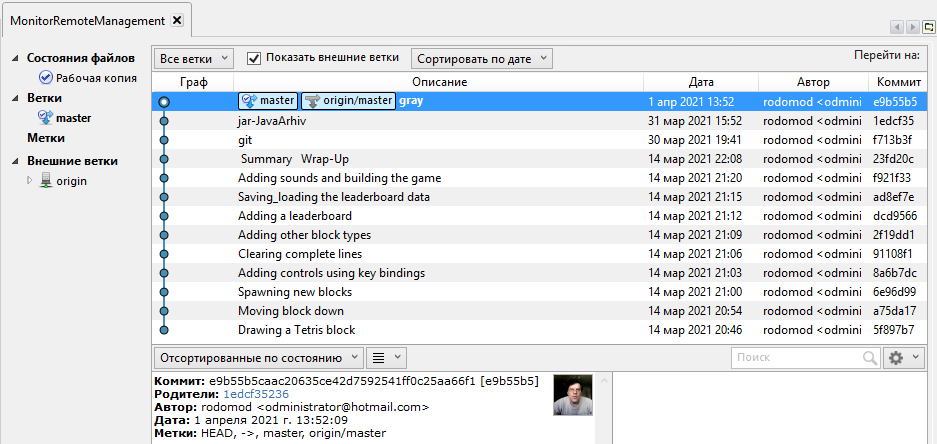

# MRM

 





# √Creating the git repository
```
$ mk dir git-tutorial 
```
   • : создал папку tutorial

```
$ cd git-tutorial 
``` 
   • : вошёл в папку tutorial
```
$ git init 
``` 
   • : инициализировал git
   
   

```
$ echo "pictyre the text" > MyFile


$ echo "echo the text.java the end" > My2File
```
   • : создал два файла с текстом...
   
   

```
$ git update-index --add MyFile My2File
```
   • : добавил в индекс для отслеживания в git
   
   

```
$ ls.git/Objects/???/*


$ ls.git/objects/?/*
```
    • :  Вывел объекты базы данных на дисплей 


#Вывод объекта по имени объекта
```
$ git cat-file -t 557db03de....
```

   
   •    : полное имя объекта
```
$ git cat-file blob 557db03	
```
  

  •    : сокращённое имя объекта 
   
 
 
#√ 


 
   •    : показать разницу между тем 
	  ,что записано в индексе и то
		,что в настоящее время в рабочем дереве(tree) 
	
```	
$ git diff-files
```


#√Добавим в файл My2File 


 
```
$ echo "Это новая запись в My2File" >> My2File	
```


#√Далее смотрим изменения


```	
$ git diff-files
``` 


#√


 
   •  работаем с деревом   :
   
   
   

```
$ git write-tree

$ tree=$(git write-tree)

$ commit=$(echo 'Initial commit' | git commit-tree $tree)

$ git update-ref HEAD $commit
```

  

  • задаём имя пользователя     :

```
$ git config --global user.name "rodomod"
```
   
   
   
   • задаём почту пользователя     :

```
$ git config --global user.email "Administrator@hotmail.com"
```
  


 
[](<a href="https://youtu.be/tPsfDhX6Jqs"> tetris the game </a>)